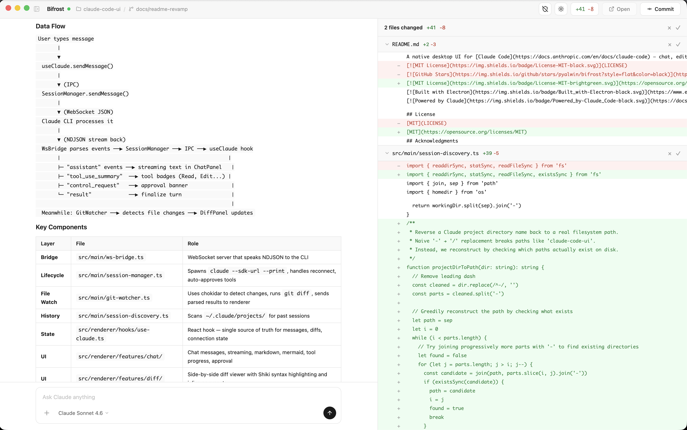
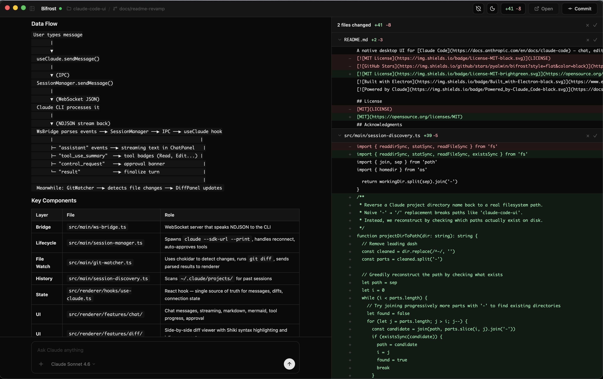

<div align="center">

# Bifrost

### The bridge between worlds

A native desktop UI for [Claude Code](https://docs.anthropic.com/en/docs/claude-code) — chat, edit, and review code changes in one window.

[](https://opensource.org/licenses/MIT)
[](https://www.electronjs.org/)
[](https://docs.anthropic.com/en/docs/claude-code)

[Getting Started](#getting-started) · [Features](#features) · [Architecture](#architecture) · [Contributing](#contributing)

<br/>



</div>

---

Claude Code is powerful, but it lives in the terminal. **Bifrost gives it a visual home** — a native desktop app where you can chat with Claude, watch it edit your code in real-time, review diffs, manage sessions, and switch between projects. All backed by the same Claude Code CLI you already use.

## Features

| Feature | Description |
|---------|-------------|
| **Live Streaming** | Real-time WebSocket connection to Claude Code CLI with token-by-token streaming |
| **Diff Viewer** | Collapsible git diff panel that auto-updates as Claude edits files, with Shiki syntax highlighting |
| **Session History** | Browse and resume any previous Claude Code session — discovers sessions from `~/.claude/projects/` |
| **Project Sidebar** | Sessions grouped by project with collapsible navigation |
| **Tool Progress** | Live indicators for Read, Edit, Bash, and other tool executions |
| **Tool Approval** | Auto-approve mode or manual approve/deny toggle for each tool use |
| **Model Selector** | Switch between Opus, Sonnet, and Haiku — persisted across sessions |
| **Rich Rendering** | Markdown, code blocks, Mermaid diagrams, tables, and inline code |
| **AskUserQuestion** | Interactive multiple-choice prompts when Claude needs input |
| **Code Review** | Inline comment threads on diff lines with reply and resolve |
| **Light/Dark Theme** | Toggle with `Cmd+D`, persisted to localStorage |

<details>
<summary><strong>Dark Mode</strong></summary>
<br/>

</details>

## How It Works

```
┌─────────────────────────────────────────────────────────┐
│ Electron Main Process                                    │
│                                                          │
│  ┌──────────────┐    WebSocket     ┌──────────────────┐ │
│  │  WsBridge     │◄──── NDJSON ───►│  Claude CLI       │ │
│  │  (ws server)  │                 │  --sdk-url        │ │
│  └──────┬───────┘                 │  --resume <id>    │ │
│         │                          └──────────────────┘ │
│         │ IPC                                            │
│  ┌──────┴───────┐                 ┌──────────────────┐ │
│  │ SessionManager│                 │  GitWatcher       │ │
│  │ (spawn/kill)  │                 │  (chokidar)       │ │
│  └──────────────┘                 │  → git diff       │ │
│                                    └────────┬─────────┘ │
├──────────────── IPC ────────────────────────┼───────────┤
│ Renderer (React)                             │           │
│                                              │           │
│  ┌─────┐ ┌────────────┐ ┌──────────────┐   │           │
│  │Side │ │  ChatPanel  │ │  DiffPanel   │◄──┘           │
│  │bar  │ │  streaming  │ │  live diffs  │               │
│  └─────┘ └────────────┘ └──────────────┘               │
└─────────────────────────────────────────────────────────┘
```

1. **Bifrost starts a WebSocket server** in the Electron main process
2. **Claude Code CLI connects** via `--sdk-url ws://localhost:PORT`
3. **Messages flow bidirectionally** — user prompts go to CLI, streaming responses come back as NDJSON events
4. **Tool approvals** are handled automatically or surfaced to the user
5. **Git diffs** update in real-time via chokidar file watching
6. **Sessions are discoverable** — scans `~/.claude/projects/` for JSONL history files

## Getting Started

### Prerequisites

- [Claude Code CLI](https://docs.anthropic.com/en/docs/claude-code) v2.0+ installed and authenticated
- [Node.js](https://nodejs.org/) 20+
- macOS, Windows, or Linux

### Install & Run

```bash
git clone https://github.com/pyalwin/bifrost.git
cd bifrost
npm install
npm run dev
```

Click **New thread** in the sidebar, select a project directory, and start chatting.

### Install With Homebrew

```bash
brew tap pyalwin/bifrost https://github.com/pyalwin/bifrost
brew install --cask pyalwin/bifrost/bifrost
```

The tap is hosted in this repository, so the full GitHub URL is required when tapping.

If macOS blocks the first launch, open **System Settings > Privacy & Security** and click
**Open Anyway** for Bifrost. That approval is only needed once per Mac.

## Tech Stack

| Layer | Technology | Purpose |
|-------|-----------|---------|
| Runtime | **Electron** | Native desktop app |
| Framework | **React 18 + TypeScript** | UI components |
| Build | **electron-vite** | Fast HMR development |
| Styling | **Tailwind CSS v4** + **shadcn/ui** | Design system |
| CLI Bridge | **ws** (WebSocket) | Real-time communication with Claude Code |
| Diff Parsing | **parse-diff** | Git unified diff → structured data |
| Syntax | **Shiki** | VS Code-grade highlighting |
| Markdown | **react-markdown** + **remark-gfm** | Rich content rendering |
| Diagrams | **Mermaid** | Flowcharts, sequence diagrams |
| File Watch | **chokidar** | Live git change detection |

## Architecture

```
src/
├── main/                    # Electron main process
│   ├── ws-bridge.ts         # WebSocket server for CLI
│   ├── session-manager.ts   # CLI process lifecycle
│   ├── git-watcher.ts       # File watching + diff updates
│   ├── diff-parser.ts       # Unified diff → DiffFileData[]
│   ├── session-discovery.ts # Scan ~/.claude for sessions
│   ├── session-history.ts   # Load JSONL conversation history
│   └── cli-discovery.ts     # Find claude binary
├── preload/                 # IPC bridge (contextBridge)
└── renderer/                # React UI
    ├── features/
    │   ├── sidebar/         # Project-grouped session list
    │   ├── chat/            # Messages, streaming, tools
    │   ├── diff/            # Git diff viewer
    │   ├── title-bar/       # Status, branch, controls
    │   └── start-screen/    # Project picker
    ├── hooks/
    │   ├── use-claude.ts    # CLI state management
    │   ├── use-theme.ts     # Light/dark toggle
    │   └── use-auto-scroll.ts
    └── types/               # Shared type definitions
```

## Development

```bash
npm run dev          # Development with hot reload
npm run typecheck    # Type check (node + web)
npm run lint         # ESLint
npm run build        # Production build
```

## Release

### Refresh Homebrew Cask

Build the macOS zip artifacts, then regenerate the Homebrew cask with current version and hashes:

```bash
npm run build:mac
npm run generate:cask
```

This updates `Casks/bifrost.rb` using the local zip artifacts and the GitHub `origin` remote.

## Contributing

Contributions are welcome! Please open an issue first to discuss what you'd like to change.

1. Fork the repo
2. Create your feature branch (`git checkout -b feat/amazing-feature`)
3. Commit your changes (`git commit -m 'feat: add amazing feature'`)
4. Push to the branch (`git push origin feat/amazing-feature`)
5. Open a Pull Request

## License

[MIT](https://opensource.org/licenses/MIT)

## Acknowledgments

- Powered by [Claude Code](https://docs.anthropic.com/en/docs/claude-code) by Anthropic
- UI components from [shadcn/ui](https://ui.shadcn.com/)
- Icons from [Lucide](https://lucide.dev/)
